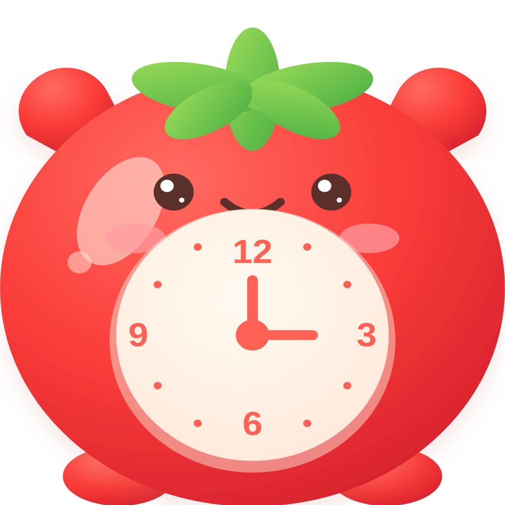
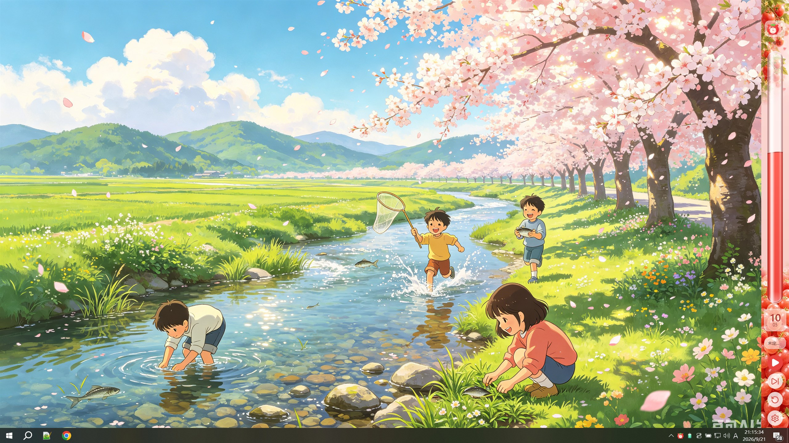
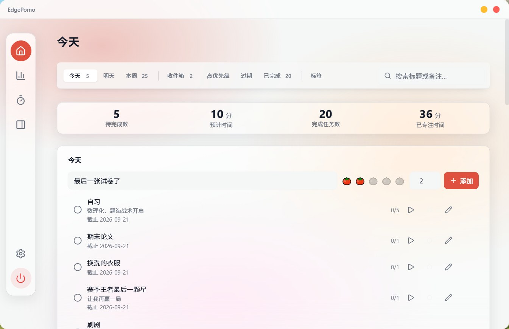
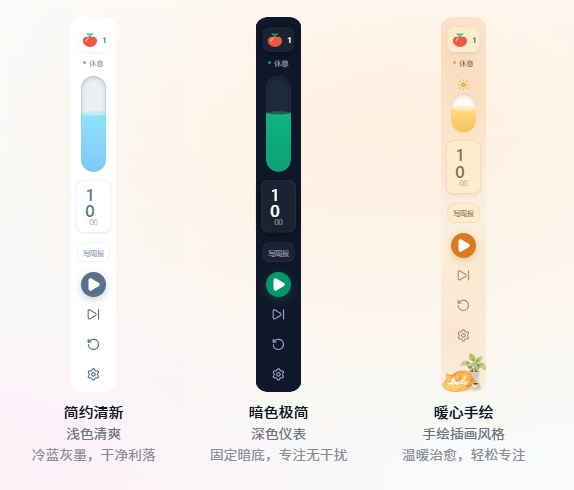
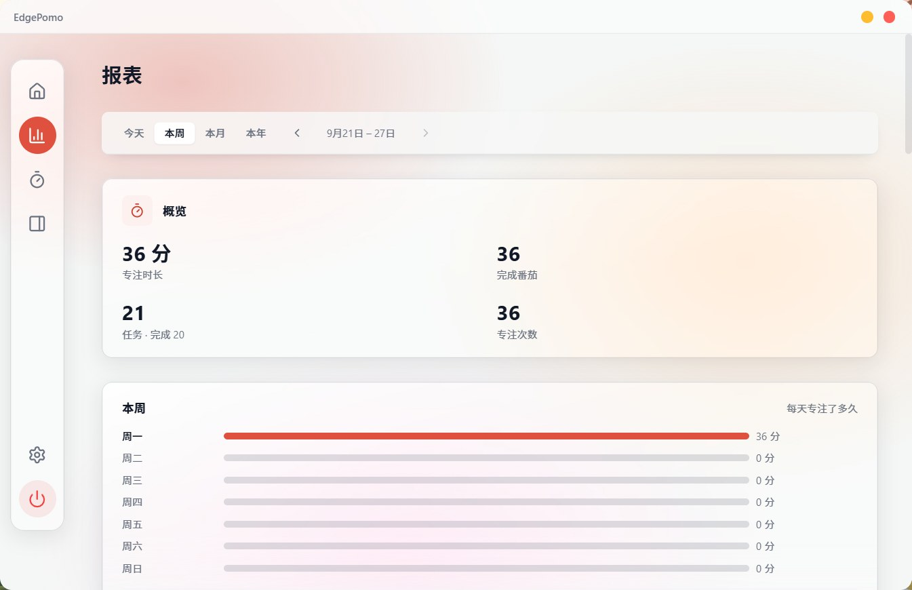
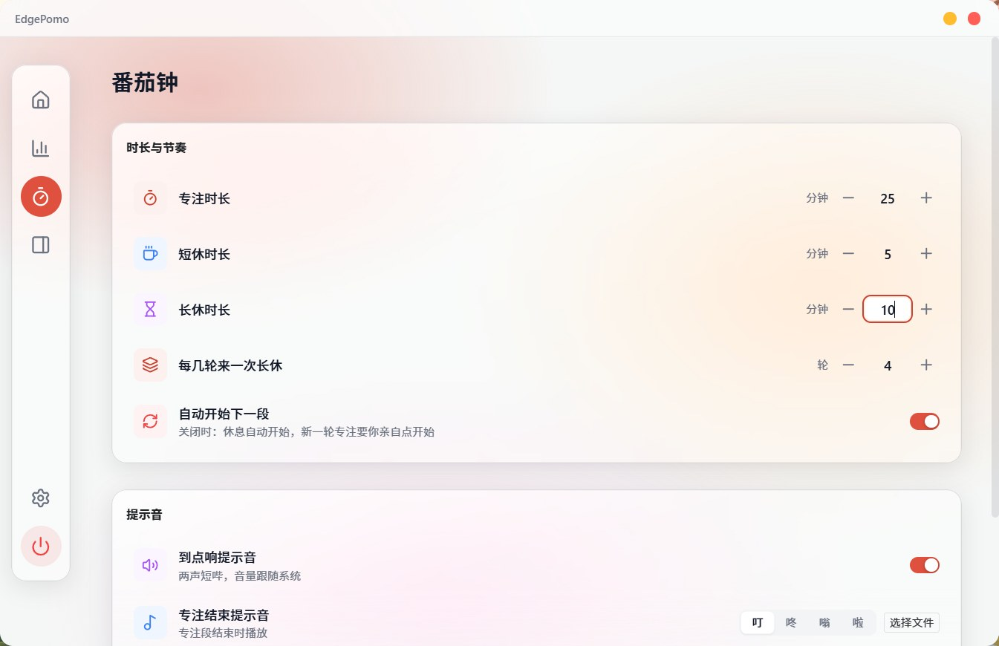
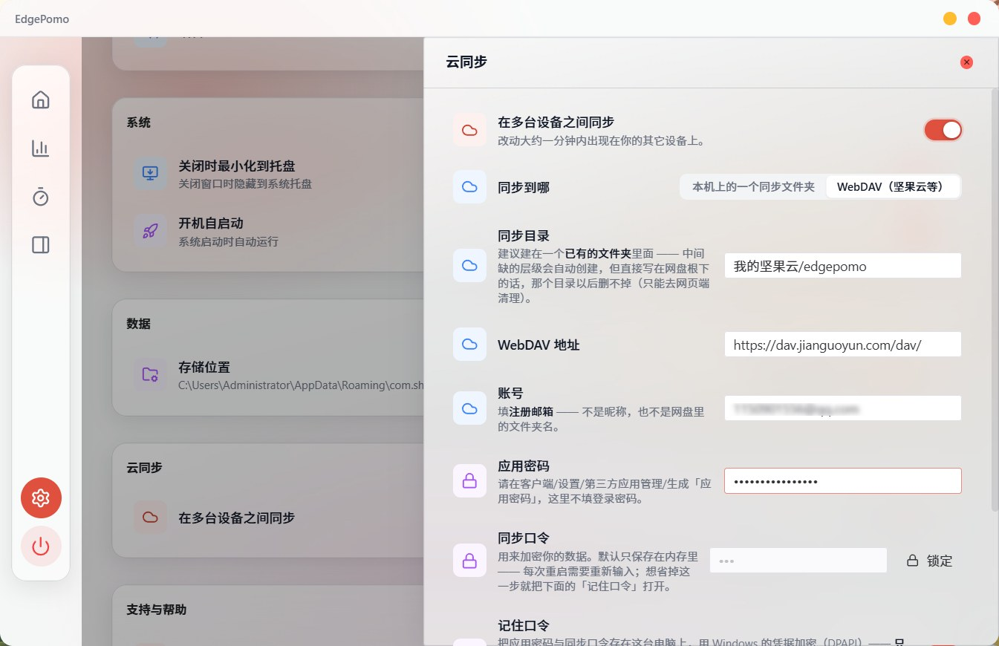

# EdgePomo

**English** · [简体中文](./README.zh-CN.md)

> A Pomodoro timer that lives on the edge of your screen. a few MB in size, no account, no extra runtime to install. Download it, and it simply stays there.

---

## Interface at a glance

A slim bar pinned to one screen edge. From the top down: a **tomato badge** carrying the number of pomodoros the current task still needs, the **phase name** (Focus / Break / Long break), the **remaining time** in large digits, **the task you're on** right below it, and four buttons — **play**, **skip**, **reset**, **settings**. The bar itself is the progress: a column of liquid in a glass tube, and its surface is where the time currently is.

*The dock in place (Sweet Tomato skin): pinned to the right edge and **reserving** it like the taskbar — nothing on your screen gets covered.*

Turn on **Simplify when idle** and the text, digits and buttons slip away while your pointer is elsewhere — the strip shrinks back to nothing but progress, and hover brings them back.

That's the entire interface. The window behind the gear button has five pages — **Home** (your tasks), **Report**, **Pomodoro**, **Dock**, **Settings** — where you change durations, edge, sounds, skins, theme and language. Open it once, then close it and forget about it.

*Home (Today): four metrics (to do / estimated left / completed / focused), then the tasks; the box at the right end of the tab row is search.*

---

## Why EdgePomo

Windows gives you a clock, and a dozen browser timers give you a tab you keep losing. Neither is really built for "I'm working right now":

| What you want | A typical timer | EdgePomo |
|---|---|---|
| See how much focus time is left | Open a window or hunt for the tab | It's already at the edge of your screen — the whole bar *is* the progress bar |
| Don't cover what I'm doing | A floating widget sits on top of your windows | It reserves an edge like the taskbar, so maximised windows flow around it instead |
| Actually notice when time's up | One toast, which Focus Assist quietly eats | Three independent channels: the bar pulses, a chime plays, and a notification is sent |
| Know how today went | Count your rounds yourself | Today's completed rounds, counted automatically, reset at midnight |
| Pick up on another PC | Your data stays on that machine; copy it by hand | Turn on **cloud sync** (on **your own WebDAV**) and your changes travel there, encrypted |
| Watch a video or play a game | The widget hangs over your content | It detects full-screen apps and steps aside, then comes back when you exit |

---

## Features

### The dock

- **The whole bar is the progress bar.** The phase drains along the bar as a column of liquid; the surface of the water marks how far the time has come. No second window to keep open — and tapping the bar answers with a ripple, so the click registers visually too.
- **Four skins.** **Sweet Tomato** (the default — a soft photo backdrop, vines at the top), **Fresh** (light, blue-grey, tidy), **Minimal dark** (always dark, nothing to look at but the numbers) and **Cozy** (cream paper with hand-drawn illustrations). All four keep the same layout — badge, phase, countdown, task, buttons — and switching shows on the live bar at once. On a narrow bar pinned to the bottom edge, where Windows leaves less room, the bar falls back to just the time and the progress instead of clipping the buttons.
- **Build your own theme.** Start from any skin as a template and pick **one theme colour**: the progress bar, buttons, phase dots, badge and cards are all recoloured from it, while the template's light/dark structure stays put. Not enough control? **Advanced settings** open up each part on its own — background, liquid, text, cards, badge, buttons — each with its own opacity slider, and every change lands on the bar as you make it. A theme can also take **your own picture** as the bar's background, and the badge glyph can be swapped for your own icon (kept in its original colours, or flattened so the theme colour still rules it). The released build keeps one custom theme; that's deliberate.
- **Colour and finish.** The bar's **background colour**, **opacity** (opaque → light → half → ghost) and a subtle **background texture** (smooth, glow or grain) live in one place, and anything your theme doesn't set falls back to them.
- **Phase at a glance.** Focus, Break, and Long break each have their own colour, and the bar dims while paused. When a phase ends it pulses until you acknowledge it.
- **Remaining work, on the badge.** The tomato at the head of the bar carries the number of pomodoros the current task still needs — nothing to count yourself, and no number at all while the task has no estimate.
- **Four buttons:** play / pause (it becomes **Acknowledge** when time is up), **skip** to end the phase now, **reset** to start it over, and the **gear** to open settings.
- **Two shortcuts:** click the bar itself (anywhere except the buttons) to start, pause or acknowledge; `Esc` does the same thing.
- **Simplify when idle.** Off by default: turn it on and only the progress stays while your pointer is elsewhere, everything else appearing again on hover.
- **Pick your edge and thickness.** Left, top, right or bottom; 72, 88 or 104 px. The bar re-negotiates with Windows immediately — no restart.

*The other three skins (left → right): **Fresh** · **Minimal dark** · **Cozy**. The default one is **Sweet Tomato** — the dock at the top of this page.*

### Getting told when time's up

Three channels that don't depend on each other, because Windows notifications alone aren't reliable:

1. **The bar pulses** — purely visual, always works.
2. **A chime plays** (on by default) — set separately for each of the three moments: *focus ended*, *short break ended*, *long break ended*. Each takes its own tone (Ding, Dong, Buzz or Chirp) or your own audio file, and every row has a preview button, so you never have to wait for the next round to find out what you picked.
3. **A system notification**, for when you're looking elsewhere.

### Full-screen aware

Playing a game, watching a video full screen, or presenting? EdgePomo notices and steps aside so it never covers your content. Leave full screen and it returns on its own.

### A one-minute tour on first launch

The first time you open EdgePomo, a spotlight tour highlights each thing where it actually lives and labels it: navigation is in this floating pill, start by adding one task, this row switches which tasks you see, double-click a task to start focusing, **the strip on your screen edge is the progress bar**, and why autostart is worth keeping on. It only points — nothing is asked of you, **Skip** or `Esc` gets you out at any step, and you land back on the page you were on. Watch it again from **Settings → Support & Help → Replay the guide**.

### Tasks

- **Bind a current task to the timer.** Its name shows on the dock right under the countdown, and the tomato badge at the head of the bar counts how many pomodoros it still needs — the list shows that progress as `2/5`.
- **Start focusing from the list.** Double-click a task — or press its play button — and it becomes the current task *and* the countdown starts immediately. That button then mirrors the bar: it turns into pause while the round runs, and pausing on either side moves the other.
- **Eight tabs, grouped so you don't have to hunt.** **Time** (Today · Tomorrow · This week) and **State** (Inbox · High priority · Overdue · Done), plus **Tags** as a third axis. Each carries a live count, so you can see where the work is without clicking through; **Today** is what greets you, and each view sorts itself by due date and priority. The row is a real tab list — `←` / `→`, `Home` / `End`, screen-reader labels included.
- **A search box sits at the right end of that row.** Type and the list filters as you go, and the keyword survives a switch between views. It searches **titles and notes**, case-insensitively and without needing the whole word — "wri" finds "write the ADR", "adr" finds "tidy up the adr index" — and **the closest match sorts first** (exact › prefix › word start › anywhere), with the hit highlighted in the title. Active tasks and the Completed archive use **one and the same matching rule**, so a word can't be findable in Today and missing from Completed. While you're searching, the quick-add row folds away (what you want now is results, not a composer), and an empty result says "No tasks match X" rather than "nothing planned today".
- **A tally at the top of each tab.** Tasks to do, estimated time left, and — where the view has a time window — tasks finished and time focused.
- **Tags group your tasks and colour your reports.** The Tags tab is one screen for both halves: how many tasks each tag holds, and create / rename / recolour / delete in place. Expand any tag — *Untagged* included — and its tasks appear right there, tickable and editable without leaving the tab.
- **A drawer, not a squeezed row.** Editing opens a glass drawer over the task list (not over the title bar or the navigation): description, due date, planned date and time, priority, tag, a 1–5 tomato estimate, **a pomodoro length of its own** (1–180 min, so a long task can count down from 45 and a small one from 10), and **repeating** tasks — daily, weekdays, weekly or monthly. `Esc`, the mask and the ✕ all close it.
- **Quick add stays quick.** Today / Tomorrow / This week / Inbox each have a composer that takes a title, an estimate and a tag in one line. Tasks added from **This week** are due Sunday by default — "sometime this week", not "today".
- **Tick it yourself**: one click on the circle freezes the task and unbinds it from the timer — and only a focus round that runs all the way to zero is counted, never one you skipped or stopped. Empty views tell you what to do next instead of just saying "nothing here".
- **Run out of estimated pomodoros and it files itself into Completed.** The moment a task has used up its estimate, that counts as you ticking the circle: it moves to Completed, counts toward today's total, and unbinds from the dock's current task. Three exceptions: **repeating tasks** sit it out (a "daily" task is meant to be checked off each day), tasks estimated at **0** (not estimated) sit it out too — which makes that field a per-task switch — and a skipped or stopped round is not a pomodoro, so it never triggers. ⚠️ New tasks come with an estimate **pre-filled at 1**, so most tasks archive after a single round; raise the estimate to run more. Archiving also clears the current task, so **the next round asks you to pick a task again**.
- **You can start without picking a task.** Press play in a focus phase with nothing bound and EdgePomo **creates an "Unnamed task"** (estimate 1) and binds it, so the round still counts and still archives — no "the round finished, but who does it belong to?".
- **Done rows carry their focus window.** The right end of a completed row shows two stacked `HH:mm` values — the span of **all** that task's focus rounds (earliest start → latest end) — with a hairline linking them, and hovering spells the whole thing out. It only appears on rows that are done.

### Statistics

Open **Report** to see where your focus time went.

*Report (This week): the summary card (focus time / pomodoros / tasks · completed / sessions), then how long each day of the week got.*

- **Four periods, one tap.** Today / This week / This month / This year (a natural calendar year). Step backwards and forwards through time with **‹ ›**, and jump back to today from anywhere.
- **Summary cards** for the selected period: focus time, completed pomodoros, tasks (with how many of them you finished), sessions — plus a **daily average**, and a strip telling you a round is running right now.
- **Breakdowns** by **tag** (colour-coded, untagged counted in) and by **task** (a bar chart that also shows done / planned), plus a **trend chart** (a daily line for the month; a 365-day line for the year).
- **Metric toggle:** focus time or pomodoro count drives the two breakdowns.
- **Focus history** lists the individual rounds in the period — completed, stopped, interrupted, ended unexpectedly — so a bad day can be explained rather than just admired.
- History is read-only — deleting a task later never rewrites the past, because reports snapshot the task name at the time.

### Settings

The floating pill on the left has five pages: **Home** (your tasks), **Report** (statistics), **Pomodoro**, **Dock**, and **Settings** at the bottom.

**Pomodoro** — focus length (default 25 min), short break (5 min), long break (15 min), rounds before a long break (4), auto-start the next phase, and the chime block. Every number can be typed in directly instead of stepped with ±.

*The Pomodoro page: durations and rhythm (every number can be typed), then the chimes — a master switch plus a tone or your own file for each of the three moments.*

**Dock** — which edge to stick to, thickness (with the real width Windows actually gave that edge, when it's less), whether the bar shows at all, simplify-when-idle, and the entry to **Sidebar appearance**: the four skins, your own theme, and the global background colour / opacity / texture.

**Settings** — Appearance (light / dark / follow system, accent colour: Mint or Tomato, interface language: English or 简体中文), System (start with Windows, minimise to tray when closing), Data (where your data lives, and moving it), **Cloud sync** (keeping several machines in step — see the next section), Support & Help (replay the guided tour, anonymous usage statistics, links), and **check for updates**.

## Always on

- **Tray icon.** Click it once to bring the settings window back; right-click for **Show window · Show dock · Start / Pause · Quit**. Hovering shows the time remaining.
- **Start with Windows**, so the bar is there before you need it.
- **Single instance.** Launching EdgePomo again doesn't open a second bar — it just brings the running one to the front.
- Closing the settings window only hides it. The bar keeps running.

## Your data, in a folder you choose

- Everything lives in one application-data folder: tasks, focus history, tags, themes, sounds, background images, preferences.
- **Settings → Data → Change location…** moves that whole folder to a directory you pick — a backup folder, an external drive, anywhere. It **copies** rather than moves, so the original is never touched and **Back to default** is always there; the new location takes effect the next time EdgePomo starts, and anything you changed in the old folder meanwhile is caught up automatically. **Show in folder** opens it whenever you want to see what's in there.
- Backup stops being an event and becomes a property of the folder: point a backup job at it, copy it to a drive, or hand the whole folder to another machine. (Live-sync folders are the exception — see the FAQ.)

---

## Two machines, one set of tasks

**Settings → Cloud sync** (off by default). There is **no EdgePomo cloud** here — the drive is **yours** (a synced folder on this PC, or your own WebDAV), and there is no account to sign up for. Switch it on and hit **Configure…**: point the **sync folder** at a synced folder on this PC (OneDrive / iCloud / Dropbox / the Nutstore desktop client), or give a **WebDAV** address instead (Nutstore, Nextcloud, ownCloud, Synology). Enter the account once (for Nutstore that's your **sign-up email**) plus an app password, unlock, and it works on its own. Changes show up on your other devices within about **a minute** — no button to press.

*Settings → Cloud sync: the page keeps one entry row and the state (problems show up there too), while the configuration lives in the drawer — carrier, folder, account, app password, sync password.*

- **What syncs is an encrypted change log, not the database file.** AES-256-GCM, with the key derived from the **sync password** you set. What lands in the cloud is a pile of files nobody can read — the password itself is never uploaded.
- **There is no "resolve conflict" dialog.** Each device writes only its own files and deletes only its own files; when two machines touched the same record, the delete / complete / content timelines each take the newest and merge silently, and the version that lost stays on that machine for 30 days.
- **A new machine = one replay.** Point it at the same folder with the same password and the whole lot comes back — no manual copying. That machine then becomes another redundant copy.
- **The password lives in memory only by default.** You retype it after each restart — deliberately, because otherwise "whoever has the data folder has everything in plain text". Tired of that? Turn on **Remember the password**: it stores the app password and the sync password on this PC with Windows DPAPI, **only this Windows account on this machine can unlock them**, sync unlocks itself after a restart, and the two boxes fill themselves in (masked as `***`). ⚠️ The flip side is real: switching machines or reinstalling Windows means typing it again, and **anyone who can already sign in as this Windows account can decrypt it**. And it is only written out after the **next successful unlock** — the line under the switch tells you truthfully whether it's stored on this PC yet or not.
- 🔴 **Lose the password and that cloud copy is gone for good** — the key is derived from it and there is no back door. Your local data is untouched and keeps working. That's why the panel carries **Export full backup**, which writes a plaintext copy of the database for you to keep.
- ⚠️ **The sync folder should live in the cloud; the data folder should not.** The two sound contradictory because they are two different things: the data folder holds the database file, which a cloud client's placeholders and live sync can break; the sync folder holds an **append-only** encrypted log, which is exactly what a cloud drive is good at carrying. Put it inside **a folder you already have** — missing levels are created for you, but a folder created directly at the drive root can never be deleted again (you'd have to clean it up from the web UI).
- The panel shows the **state, the last successful sync, the last error** and how large the change log has grown. Sync rotting away silently for months is one of the things this product fears most, so it does not fail quietly.

---

## Get started in 2 minutes

1. Download the installer below and run it.
2. Start EdgePomo — the bar appears on the right edge, the settings window opens once, and a short tour points at the things worth knowing where they are.
3. Press play on the bar. The colour band starts draining.
4. When time is up, the bar pulses and chimes. Click the bar (or press `Esc`) to acknowledge; the break then begins on its own.
5. Later, open **Pomodoro** for your own durations and chimes, **Dock** to move the bar, change its thickness or appearance; **Home** to plan tasks; **Report** to review your week; and if you have a second machine, **Settings → Cloud sync** to hook it up.

> Tip: the ✕ on the settings window **hides it to the tray**, it doesn't quit. Use **Quit** in the tray menu to exit completely.

---

## Download & install

| Source | Link |
|---|---|
| Gitee (recommended inside China, faster) | <https://gitee.com/ShiXiongZhiDao/EdgePomo/releases> |
| GitHub | <https://github.com/ShiXiongZhiDao/EdgePomo/releases/latest> |

- Both an installer (`.exe`, NSIS) and an `.msi` package are published — pick either.
- Installs for the current user, no administrator rights required.

### System requirements

- **Windows 10 or Windows 11, 64-bit.**
- **WebView2 Runtime** — already included with Windows 11; on Windows 10 it's normally installed through Windows Update, and the installer will guide you if it's missing.
- EdgePomo is a desktop app for Windows. It does not run in a browser, and there is no macOS or Linux build.

### Windows says "Windows protected your PC"

That's SmartScreen reacting to an installer without a paid code-signing certificate — not a virus. Click **More info → Run anyway** to continue. The source and the installers are published in the same public repository, so you can check for yourself.

---

## Updates, data & uninstall

**Updates.** Open **Settings → Check for updates**. When a new version is found, a dialog lets you install it now, later, or skip that version entirely (EdgePomo remembers and stops asking).

**Will I lose my data?** No. Updates replace program files only — your durations, preferences, tasks and history are kept.

**Where is my data?** In one folder under your user profile, unless you pointed EdgePomo somewhere else — **Settings → Data** shows the path and opens it. Copying that folder is the whole backup.

**Uninstall.** Go to **Settings → Apps → Installed apps** (Windows 10: *Apps & features*), find **EdgePomo** and uninstall. The uninstaller leaves your data folder in place; delete `%APPDATA%\com.shixiong.edgepomo` (or the folder you moved it to) if you want to wipe everything — for example before handing the PC to someone else.

---

## Privacy

**Everything stays on this machine by default.** Task titles and notes, tag and theme names, focus history, durations, preferences, sounds and images are written to local files — no account, no login, and EdgePomo **runs no server of its own**: there is no EdgePomo cloud to upload anything to.

**Multi-device sync runs on your own WebDAV** (off by default). Enter **your own** WebDAV address in **Settings → Cloud sync** (Nutstore, Nextcloud, ownCloud, Synology), or point it at a synced folder on this PC, and the app writes an **encrypted change log** to **your own drive** to keep several machines in step. The key is derived from the sync password you set, so your cloud provider can't read it any more than we can. The cost, stated plainly: **whoever has the sync password can decrypt it**, and a **lost password means that copy is unrecoverable**.

Apart from sync itself, everything else — the bar, the timer, the reports, the files — works with the network unplugged.

---

## FAQ

**Q: The bar disappeared.**
Right-click the tray icon → **Show dock**. If that doesn't bring it back, check whether a full-screen app is running — that's the other reason it hides.

**Q: The bar went quiet — just a strip of colour, no digits.**
That's **Simplify when idle**: the contents hide while your pointer is away and come back on hover. Turn it off on the **Dock** page if you always want the numbers visible.

**Q: The bar is thinner than the thickness I chose.**
On the bottom edge the taskbar competes for the same space, so Windows hands EdgePomo less. The **Dock** page tells you the actual thickness on that edge. Choose another edge if you want the full size.

**Q: I never heard the chime.**
Check that **Chime when time is up** is on, that system volume is up and not muted, and use the preview button on the **Pomodoro** page — the three moments are configured separately, so the tone you hear at the end of focus is not necessarily the one you set for the end of a break. The chime is the primary alert — don't rely on the toast alone, because Focus Assist can silence it.

**Q: No notification popped up.**
Windows is probably holding it back: open **Settings → System → Notifications** and turn off Focus Assist / Do not disturb. The bar still pulses and chimes regardless.

**Q: Does a skipped or stopped round count?**
No. Only a focus round that runs all the way to zero is counted. Today's counter resets at midnight.

**Q: Why does a second launch not open a second bar?**
On purpose. Two bars would each reserve workspace, each run their own timer, and each chime. Launching EdgePomo again just brings the running instance forward.

**Q: Can I move my history to another PC?**
Yes, two ways. Copy the whole data folder to the same location on the new machine (**Settings → Data** shows which folder that is), or open **Settings → Cloud sync** there with the same sync folder and the same password and let it replay everything — ⚠️ but anything stored by **Remember the password** follows your Windows account, so it has to be typed once on the new machine.

**Q: Can I keep the data in OneDrive / iCloud so both machines match?**
Not that folder directly — live-sync clients replace files with placeholders and rewrite them while EdgePomo is mid-write, which can break saving. Keep the data local; copy or back it up on a schedule instead. **If you want two machines to match automatically, use Settings → Cloud sync** — what it puts in the cloud is an append-only encrypted log, built for exactly this.

**Q: Can two PCs sync automatically?**
Yes — **Settings → Cloud sync** (off by default). Point the sync folder at a synced folder, or enter your own WebDAV address (Nutstore and friends), and set a sync password. Changes travel on their own within about a minute. Turn on **Remember the password** and a restart won't ask again (that copy can only be unlocked by this Windows account on this machine).

**Q: I forgot the sync password.**
That cloud copy is then **gone for good** — the key is derived from the password and there is no back door. Your local data is unaffected and keeps working. To leave yourself a way out, use **Export full backup** on the cloud-sync panel and keep the plaintext copy somewhere safe.

**Q: Can I just put the sync folder anywhere?**
Two rules. ① Put it inside **a folder you already have** (missing levels are created automatically, but a folder created directly at the cloud drive's root can never be deleted — you'd have to clean it up from the web UI). ② It is **not** the data folder: the data folder should stay off cloud drives, while the sync folder is exactly where a cloud drive belongs.

**Q: I closed the tour too fast. Can I see it again?**
**Settings → Support & Help → Replay the guide.**

**Q: My antivirus flags the installer.**
Unsigned small tools get false positives from time to time. The installers come straight from the releases page of this public repository.

---

## ☕ Support the author

If EdgePomo helps you get through the day, you can buy the author a coffee. Thank you — it keeps the project moving.

| Alipay | WeChat Pay |
|---|---|
|  |  |

Feedback and bug reports: [GitHub Issues](https://github.com/ShiXiongZhiDao/EdgePomo/issues) · [Gitee Issues](https://gitee.com/ShiXiongZhiDao/EdgePomo/issues) · WeChat Official Account: **师兄知道**

---

## License & notice

EdgePomo is **free to use**.

No open-source licence file has been added to this repository yet; until one is, please treat it as **all rights reserved** — do not redistribute the source or the installers commercially.

---

## 📮 Contact

- Author: 师兄知道
- WeChat Official Account: 师兄知道
